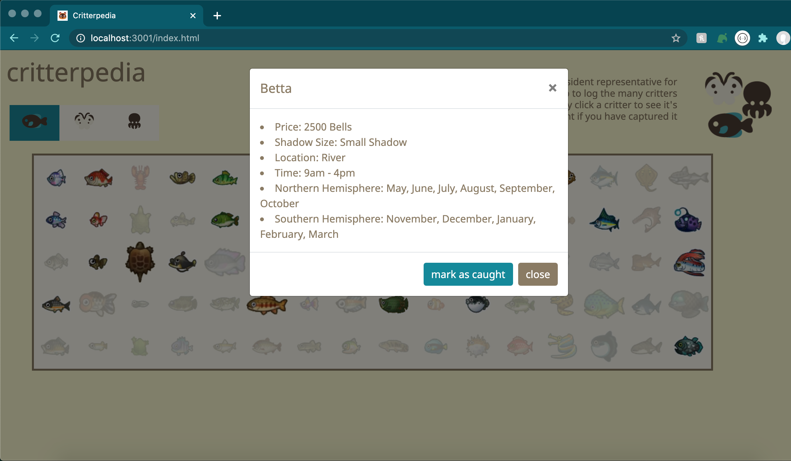

# critterpedia_frontend
<h2>Description</h2>
Critterpedia is an app for Animal Crossing New Horizons players to track the fish, bugs, and deep sea creatures they catch in the game.
To see information such as sell price, location, times available, and months available, click on the critter icon.  To track a critter as caught, click on
a critter and then mark the critter as caught.  The icon will now show as opaque, visually representing that the critter has ben recorded.

<h2>Visuals</h2>

<h2>Technologies</h2>
I used Ruby on Rails for the backend and the frontend comprises of vanilla JS, HTML, and CSS.

<h2>Author</h2>
<a href="https://github.com/kelseymosh"> Kelsey Oshiro</a>
